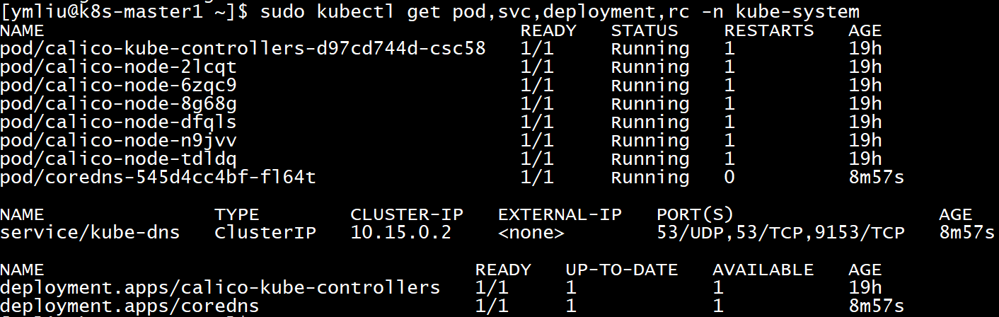
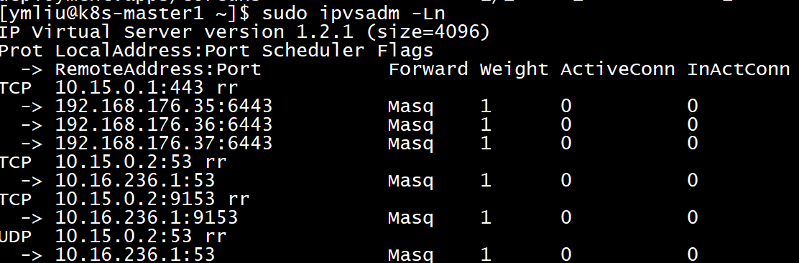

# 部署Kubernetes DNS

所有插件中，第一要部署的就是DNS插件。

早期使用kube-dns插件，现在逐渐替换为coreDNS插件。

## 编辑部署文件coredns.yaml

文件原型看这里[`coredns.yaml`](coredns.yaml)。

- dns部署在`kube-system`命名空间内。
- 创建ServiceAccount `coredns`，创建相应的ClusterRole并绑定。

### ConfigMap

`coreydns.yaml`文件的56-82行为ConfigMap。

- 65行，**:53**表示dns端口使用53端口（tcp/udp）。
- 71行，表示当前域名，默认域名是`kubernetes`，后缀是`cluster.local`，可以从kubernetes的证书请求csr文件中看到。
- 77行，配置外部dns转发地址。

### Deployment

- 127行，指定资源需求，视情况而定，此处最小需要170MB内存。

### Service

- 200行，指定该服务IP为`10.15.0.2`，必须与kublet.yaml中指定地址一致。ps: `10.15.0.1`是集群地址。

## 执行部署

```bash
# 部署
$ kubectl create -f ~/yaml/calico.yaml
# 查看
$ kubectl get pod,svc,deployment,rc -n kube-system
```



该dns服务是对kubernetes内部pod提供dns解析，故没有external-ip。

查看ipvs转发情况，可以看到dns的标准端口tcp 53, udp 53均已转发至service-ip port。

`sudo ipvsadm -Ln`



## 补充说明

CoreDNS一旦部署成功，kubelet在调度创建**新的pod**的时候，会将CoreDNS的service ip和search domain替换到pod的`/etc/resolv.conf`文件中，以便于pod在需要dns解析时，访问CoreDNS服务。

同时会将创建的新的Service注册到CoreDNS中，其注册域名与namespace有关，格式为：

`<service-name>.<namespace-name>.svc.cluster.local`

例如：某服务名为**xxx-svc**，命名空间为**yyy-ns**，则注册名为**xxx-svc.yyy-ns.svc.cluster.local**，其中***svc.cluster.local***为集群定义。
