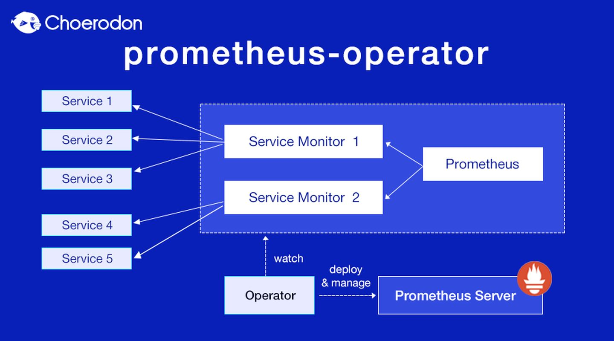

# 部署监控 Prometheus + Grafana

Prometheus的部署是一个比较复杂的步骤，主要是Prometheus由非常复杂的一系列组件构成。主要包括：

- operator      - 好像是规则定义
- state-metrics - 好像是metrics抓取
- alertmanager  - 告警管理
- adapter       - 适配器
- prometheus    - 主体本身
- grafana       - 展示界面（独立的服务）
- blackbox      - 好像是黑盒

下面依次部署各个组件。

## 基础环境准备

本节准备整个监控系统的环境，包括NameSpace,ServiceAccount,RBAC等。

- 定义namespace，名为**monitoring**。[00-namespace.yaml](00-namespace.yaml)
- 部署动态存储卷，包括：
  - 定义[ServiceAccount：**nfs-client-provisioner-monitoring**](01-storage-serviceAccount.yaml)。
  - 定义[ClusterRole](02-stroage-clusterRole.yaml)，和[ClusterRoleBinding](02-storage-clusterRoleBinding.yaml)。
  - 部署存储[Pod](11-storage-deployment.yaml)。
  - 提供存储服务[StorageClass](12-storage-storageClass.yaml)

至此，已准备好监控命名空间**monitoring**，并在该命名空间下提供动态存储卷**nfs-dynamic-monitoring**。

## Operator

Prometheus Operator 提供如下功能：

- 创建/销毁：在Kubernetes namespace中更加容易地启动一个Prometheus实例，一个特定应用程序或者团队可以更容易使用Operator。
- 便捷配置：通过Kubernetes资源配置Prometheus的基本信息，比如版本、存储、副本集等。
- 通过标签标记目标服务：基于常见的Kubernetes label查询，自动生成监控目标配置；不需要学习Prometheus特定的配置语言。

### 自定义资源（CustomResourceDefinition - CRD）

Operator 定义了如下的四类自定义资源（CustomResourceDefinition - CRD）：

#### Prometheus

Prometheus自定义资源（CRD）声明了再Kubernetes集群中运行的Prometheus的期望设置，包括副本数量，持久化存储，以及Prometheus示例发送警告到Alertmanagers等配置选项。

每一个Prometheus资源，Operator都会在相同的namespace下部署成一个正确配置的StatefulSet，Prometheus的Pod都会挂载一个名为\<prometheus-name\>的Secret，里面包含了Prometheus的配置，Operator根据包含的ServiceMonitor生成配置，并且更新含有配置的Secret。无论是对ServiceMonitors或者Prometheus的修改，都会持续不断的按照前面的步骤更新。

#### AltermanagerConfig 和 Alertmanager

Alertmanager自定义资源（CRD）申明在Kubernetes集群中运行Alertmanager的期望设置，它也提供了配置副本集和持久化存储的选项。

每一个Alertmanager资源，Operator都会在相同的namespace下部署成一个正确配置的StatefulSet，Alertmanager pods配置挂载一个名为\<alertmanager-name\>的Secret，使用`alermanager.yaml` key对作为配置文件。

当有两个或更多配置的副本时，Operator可以High-Availabe模式运行Alertmanager实例。

#### ServiceMonitor

- Podmonitor
- Probe
- PrometheusRule
- Thanosruler
