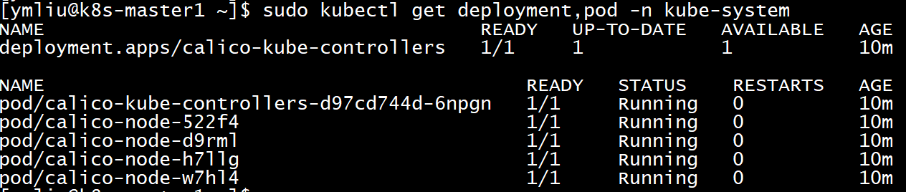
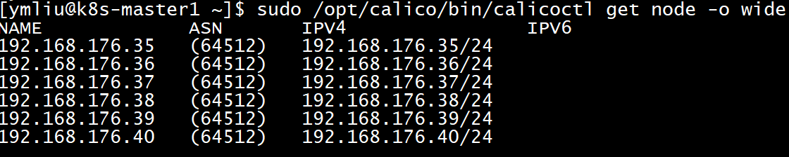
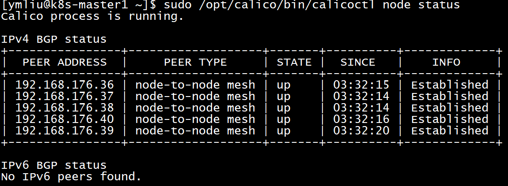
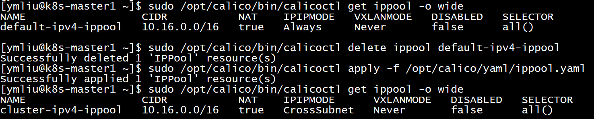
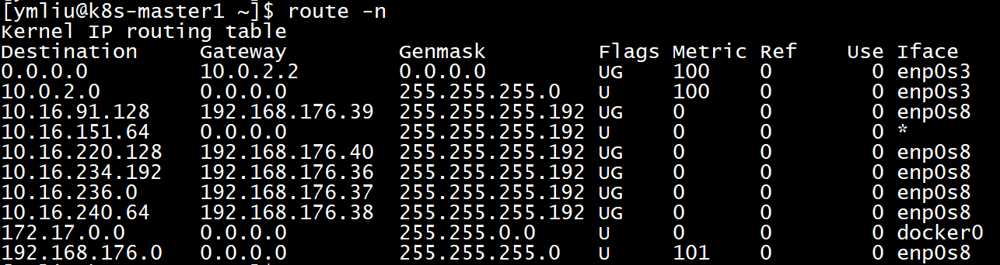
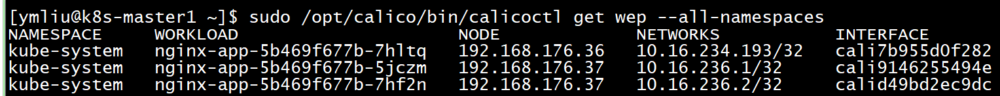

# 安装CNI插件Calico

Calico提供容器网络，要求在每一个Worker节点都要安装，而且要能够访问到ETCD。

## 准备阶段

### 准备目录

在最开始已经准备了相关的目录，此处再重复一遍。

```bash
# 主目录（程序文件、配置文件）
$ sudo mkdir -p /opt/calico/{bin,conf,yaml}
# cni插件程序文件
$ sudo mkdir -p /opt/cni/bin
# cni插件配置
$ sudo mkdir -p /etc/cni/net.d
```

### 准备策略文件（calico.sh）

该文件位于`/etc/profile.d/calico.sh`

```bash
CALICO_HOME="/opt/calico"
export PATH=$PATH:$CALICO_HOME/bin
```

目前Calico使用的版本是v3.5.1。

请注意：**所有版本，包括程序主体、命令行以及容器镜像，一定要一致**。

### 下载程序包

- Calico 主程序 <https://github.com/projectcalico/cni-plugin/releases/download/v3.15.1/calico-amd64>
- Calico-ipam 主程序 <https://github.com/projectcalico/cni-plugin/releases/download/v3.15.1/calico-ipam-amd64>
- Calico命令行 <https://github.com/projectcalico/calicoctl/releases/download/v3.15.1/calicoctl-linux-amd64>
- 通用插件 <https://github.com/containernetworking/plugins/releases/download/v0.8.6/cni-plugins-linux-amd64-v0.8.6.tgz>

### 解压、安装程序包

将上述下载的程序包解压到指定目录。

```bash
# cni插件
$ sudo tar -xvzf cni-plugins-linux-adm64-v0.8.6.tgz -C /opt/cni/
$ sudo cp -f /opt/cni/{bandwidth,loopback,portmap,tuning} /opt/cni/bin/
$ sudo chmod +x /opt/cni/bin/*
# 将程序包复制到指定目录
$ sudo cp -f calico-amd64 /opt/cni/bin/calico
$ sudo cp -f calico-ipam-amd64 /opt/cni/bin/calico-ipam
$ sudo cp -f calicoctl /opt/cni/bin/calicoctl
```

### 导入docker镜像

```bash
# 拉取docker镜像
$ sudo docker pull calico/node:v3.15.1
$ sudo docker pull calico/cni:v3.15.1
$ sudo docker pull calico/kube-controllers:v3.15.1
$ sudo docker pull calico/pod2daeon-flexvol:v3.15.1
```

## 部署

### 创建CNI网络配置文件（calico.conflist）（可忽略）

该文件位于`/etc/cni/net.d/10-calico.conflist`，注意必须在这个目录中。

```json
{
  "name": "k8s-pod-network",
  "cniVersion": "0.3.1",
  "plugins": [
    {
      "type": "calico",
      "log_level": "info",
      "etcd_endpoints": "https://192.168.176.35:2379,https://192.168.176.36:2379,https://192.168.176.37:2379",
      "etcd_key_file": "/etc/cni/net.d/calico-tls/etcd-key",
      "etcd_cert_file": "/etc/cni/net.d/calico-tls/etcd-cert",
      "etcd_ca_cert_file": "/etc/cni/net.d/calico-tls/etcd-ca",
      "mtu": 1500,
      "ipam": {
          "type": "calico-ipam"
      },
      "policy": {
          "type": "k8s"
      },
      "kubernetes": {
          "kubeconfig": "/etc/cni/net.d/calico-kubeconfig"
      }
    },
    {
      "type": "portmap",
      "snat": true,
      "capabilities": {"portMappings": true}
    },
    {
      "type": "bandwidth",
      "capabilities": {"bandwidth": true}
    }
  ]
}
```

- `etcd_endpoints`：指向etcd，可用安装ETCD时定义的环境变量`${ETCD_ENDPOINT}`。
- `etcd_*_file`：访问etcd需要的认证文件，采用默认配置，这个配置内容与容器运行参数相关。
- `kubeconfig`：同样采用默认配置。

### 创建calico与etcd交互文件（calicoctl.cfg）

该文件位于`/etc/calico/calicoctl.cfg`。

```yaml
apiVersion: projectcalico.org/v3
kind: CalicoAPIConfig
metadata:
spec:
  datastoreType: "etcdv3"
  etcdEndpoints: "https://192.168.176.35:2379,https://192.168.176.36:2379,https://192.168.176.37:2379"
  etcdKeyFile: "/opt/ssl/etcd-key.pem"
  etcdCertFile: "/opt/ssl/etcd.pem"
  etcdCACertFile: "/opt/ssl/ca.pem"
```

从上述配置可以看出，在每个Worker节点，需要etcd证书的支撑。

### 创建calico容器部署文件（calico.yaml）

采用容器方式部署calico，其部署文件为[`calico.yaml`](calico.yaml)。

这个文件非常大，分成好几个部分，以下逐一说明。

- Secret段：配置calico所需要的证书信息，主要是与etcd交互的证书内容。其中etcd-key/etcd-cert/etcd-ca分别对应私钥、证书和ca证书文件的**内容**，而**不是文件名**；需要经对应文件经过base64编码后填充，通过命令`cat XXX.pem | base64 -w 0`获得。
- ConfigMap段：配置信息。
  - etcd_endpoints：指向访问的etcd集群地址。
  - etcd_ca/etcd_cert/etcd_key：指向**容器内**的文件位置，使用默认值，不建议修改，需与后续Daemon node段的mountVolume对应。
  - cni_network_config：实质是创建容器内的`calico.conflist`文件。
- Daemon node段：部署主要的容器，以守护进程方式，适配本地网络（hostNetwork），忽略污点，即每一个worker节点都要运行一个daemon container。
  - 配有两个初始化容器（initContainer）：install-cni和和flexvl-driver，其作用自行查阅。
  - 容器calico-node的环境变量`IP_AUTODETECTION_METHOD`，目的是解决worker节点有多快网卡时，指定一块网卡作为工作网卡。
  - 环境变量`NODENAME`，与kubelet,kube-proxy一致，采用当前节点的IP，`fieldRef:fieldPath:status.hostIP`。
  - 环境变量`CALICO_IPV4POOL_CIDR`，即PODs的IP地址段，与前面kube-apiserver, kubelet等一致。
- Daemon controller段：策略控制守护进程，仅运行一个副本。

### 执行部署

在任意一节点执行发布，仅执行一次即可。

`kubectl create -f /opt/calico/yaml/calico.yaml`

执行完成后，查看kube-system空间下的pod/deployment。

`kubectl get deployment,pod -n kube-system`



### 查看calico node信息

`sudo calicoctl get node -o wide`



### 查看peer信息

peer，即一个worker节点的calico node在整个calico网络中的定位。

`sudo calicoctl node status`



可以看到当前peer与其它peers的连接情况。

**注意**：calicoctl的版本需在v3.12以上，否则有bug。

**注意2**：calicoctl与calico node的版本要保持一致，当前使用版本为v3.15.1；吃过亏，calicoctl v3.14与calico node v3.15.1，死活显示未启动。

### 创建/修改calico ippool

ippool是PODs的IP分配池，修改calico ippool目的在于配置cidr的ip range/nat/ipipmode参数，也可创建多个ippool。

```bash
# 查看当前ippool配置
$ sudo calicoctl get ippool -o wide

# 删除默认ipv4 ippool
$ sudo calico delete default-ipv4-pool

# 创建自定义ippool，nat为true, ipipmode为CrossSubnet（跨子网封装）
$ sudo calicoctl apply calico-ippool.yaml
```

```yaml
# calico-ippool.yaml
apiVersion: projectcalico.org/v3
kind: IPPool
metadata:
  name: cluster-ipv4-ippool
spec:
  cidr: 10.16.0.0/16
  ipipMode: CrossSubnet
  natOutgoing: true
```



## 其他查看命令

### 查看路由表

`$ route -n`



### 查看分配、映射情况

启动3个空载的nginx，再查看calico对pod ip的分配、映射情况。

`sudo calicoctl get wep --all-namespaces`



可看到3个nginx pod运行在哪个worker节点，分配的cidr ip具体是多少。
