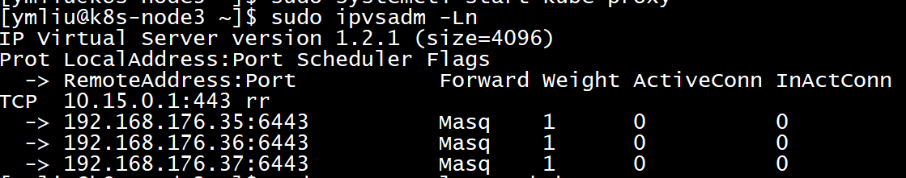

# 安装kube-proxy组件

## 制作kube-proxy证书

### 创建csr请求的json文件（kube-proxy-csr.json）

文件位于`/opt/ssl/kube-proxy-csr.json`。

```json
{
  "CN": "system:kube-proxy",
  "key": {
    "algo": "rsa",
    "size": 2048
  },
  "names": [
      {
        "C": "CN",
        "ST": "Chongqing",
        "L": "Chongqing",
        "O": "system:kube-proxy",
        "OU": "ymliu"
      }
  ]
}
```

### 制作证书（kube-proxy.pem）和私钥

```bash
$ cd /opt/ssl
$ sudo ./cfssl gencert  \
    -ca=ca.pem \
    -ca-key=ca-key.pem \
    -config=/opt/ssl/ca-config.json \
    -profile=kubernetes kube-proxy-csr.json \
    | sudo ./cfssljson -bare kube-proxy
```

生成证书`kube-proxy.pem`和私钥`kube-proxy-key.pem`文件，分发至所有Worker节点。

## 创建kube-proxy服务

### 创建kube-proxy服务kubeconfig配置文件（kube-proxy.kubeconfig）

文件位于`/opt/k8s/conf/kube-proxy.kubeconfig`。

```bash
$ declare KUBE_APISERVER="https://192.168.176.34:8443"
$ declare CAFILE="/opt/ssl/ca.pem"
$ declare KUBECONFIG="/opt/k8s/conf/kube-proxy.kubeconfig"

$ sudo kubelet config set-cluster kubernetes \
    --certificate-authority=${CAFILE} \
    --embed-certs=true \
    --server=${KUBE_APISERVER} \
    --kubeconfig=${KUBECONFIG}
$ sudo kubelet config set-credentials kube-proxy \
    --client-certificate=/opt/ssl/kube-proxy.pem \
    --client-key=/opt/kube-proxy-key.pem \
    --embed-certs=true \
    --kubeconfig=${KUBECONFIG}
$ sudo kubelet config set-context default \
    --cluster=kubernetes \
    --user=kube-proxy
    --kubeconfig=${KUBECONFIG}
$ sudo kubelet config use-context default \
    --kubeconfig=${KUBECONFIG}
```

### 创建Service Unti服务单元文件（kube-proxy.service）

文件位于`/etc/systemd/system/kube-proxy.service`。

```conf
[Unit]
Description=Kubernetes Kube-Proxy Server
Documentation=https://github.com/kubernetes/kubernetes
After=network.target

[Service]
EnvironmentFile=/opt/k8s/conf/kube-proxy.conf
WorkingDirectory=/ext/k8s/proxy
ExecStart=/opt/k8s/bin/kube-proxy \
  --config=${KUBE_PROXY_CONFIG} \
  --log-dir=${KUBE_PROXY_DIR} \
  --logtostderr=true \
  --alsologtostderr=true \
  --v=4
Restart=on-failure
RestartSec=5
LimitNOFILE=65536

[Install]
WantedBy=multi-user.target
```

### 创建环境变量文件（kube-proxy.conf）

文件位于`/opt/k8s/conf/kube-proxy.conf`。

```conf
## kubernetes kube-proxy system config
#

## Ip address of local machine, modify it
#KUBE_PROXY_ADDRESS="192.168.176.35"

## Setting kubeconfig file.
#KUBE_PROXY_KUBECONFIG="/opt/k8s/conf/kube-proxy.kubeconfig"
KUBE_PROXY_CONFIG="/opt/k8s/yaml/kube-proxy.yaml"

## Setting ip range for pods
#KUBE_CLUSTER_CIDR="10.16.0.0/16"

## Setting log directory
KUBE_PROXY_DIR="/ext/k8s/proxy"
#KUBE_FEATURE_GATES="SupportIPVSProxyMode=true"
#KUBE_PROXY_MODE="ipvs"
```

### 创建YAML配置文件（kube-proxy.yaml）

新版本推荐使用配置文件进行配置，本文使用YAML文件。

- 注：YAML文件不能使用环境变量，必须直接写入配置参数值。

文件位于`/opt/k8s/yaml/kube-proxy.yaml`。

```yaml
apiVersion: kubeproxy.config.k8s.io/v1alpha1
kind: KubeProxyConfiguration
bindAddress: 192.168.176.35
hostnameOverride: 192.168.176.35
metricsBindAddress: 192.168.176.35:10249
clientConnection:
  kubeconfig: /opt/k8s/conf/kube-proxy.kubeconfig
clusterCIDR: 10.16.0.0/16
healthzBindAddress: 192.168.176.35:10256
mode: ipvs
ipvs:
  minSyncPeriod: 5s
  scheduler: rr
```

- `bindAddress`：监听地址，该地址对集群及外部可访问。
- `hostnameOverride`：**必须**与kubelet同名参数一致，否则kube-proxy启动后会找不到node，从而不会创建任何ipvs规则。
`clientConnection`：连接kube-apiserver使用的默认kubeconfig文件。
`clusterCIDR`：PODs地址池，kube-proxy根据该参数判断集群内部和外部流量，指定`--cluster-cidr`或`--masquerade-all`选项后，kube-proxy才会对访问Service IP的请求作SNAT。
- `mode`：使用ipvs模式。

## 启动服务并验证

### 设置开机自启动、启动服务

```bash
# 刷新配置，开机自启动，启动服务，查看状态和日志
$ sudo systemctl daemon-reload
$ sudo systemctl enable kube-proxy
$ sudo systemctl start kube-proxy
$ sudo systemctl status kube-proxy
$ sudo journalctl -f -n 1000 -u kube-proxy
```

### 查看LVM状态

在任意一个worker节点执行ipvsadm命令查看转发情况：

`$ sudo ipvsadm -Ln`


可以看到所有kubernetes cluster ip(10.15.0.1) 443端口的请求都转发到kube-apiserver节点的6443(HAProxy代理)端口。
