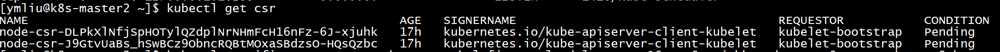
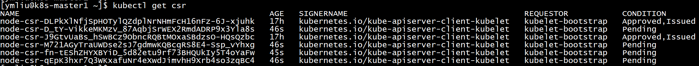

# 安装kubelet组件

## 创建kubeconfig文件

需要创建两个kubeconfig文件：一个是kubelet服务使用的默认kubeconfig文件`kubelet.kubeconfig`；另一个也是kubelet服务使用，用于bootstrap的`bootstrap.kubeconfig`。

```bash
# 定义变量
$ declare KUBE_APISERVER="https://192.168.176.34:8443"
$ declare CAFILE="/opt/ssl/ca.pem"
$ declare KUBECONFIG="*.kubeconfig文件"

# 创建 bootstrap.kubeconfig
$ declare KUBECONFIG="/opt/k8s/conf/bootstrap.kubeconfig"
$ declare TOKEN=$(sudo cat /opt/k8s/token/bootstrap.csv | awk -F ',' '{print $1}')
$ sudo kubelet config set-cluster kubernetes \
    --certificate-authority=${CAFILE} \
    --embed-certs=true \
    --server=${KUBE_APISERVER}
$ sudo kubelet config set-credentials kubelet-bootstrap \
    --token=${TOKEN}
    --kubeconfig=${KUBECONFIG}
$ sudo kubelet config set-context default \
    --cluster=kubernetes \
    --user=kubelet-bootstrape \
    --kubeconfig=${KUBECONFIG}
$ sudo kubectl config use-context default
    --kubeconfig=${KUBECONFIG}

# 创建 kubelet.kubeconfig
$ declare KUBECONFIG="/opt/k8s/conf/kubelet.kubeconfig"
$ sudo kubelet config set-cluster kubernetes \
    --certificate-authority=${CAFILE} \
    --embed-certs=true \
    --server=${KUBE_APISERVER} \
    --kubeconfig=${KUBECONFIG}
$ sudo kubelet config set-credentials kubelet
    --token=${TOKEN} \
    --kubeconfig=${KUBECONFIG}
$ sudo kubelet config set-context default \
    --cluster=kubernetes \
    --user=kubelet \
    --kubeconfig=${KUBECONFIG}
$ sudo kubelet config use-contex default \
    --kubeconfig=${KUBECONFIG}
```

将kubelet-bootstrap用户绑定到系统集群角色，在一个Master的活动节点执行一次即可。

```bash
$ sudo kubectl create clusterrolebinding kubelet-bootstrap \
    --clusterrole=system:node-bootstrapper \
    --user=kubelet-bootstrap
```

## 创建Service Unit服务单元文件（kubelet.service）

服务单元文件位于`/etc/systemd/system/kubelete.service`。

```conf
[Unit]
Description=Kubernetes Kubelet Server
Documentation=https://github.com/kubernetes/kubernetes
After=docker.service
Requires=docker.service

[Service]
WorkingDirectory=/ext/k8s/kubelet
EnvironmentFile=/opt/k8s/conf/kubelet.conf
ExecStart=/opt/k8s/bin/kubelet \
  --hostname-override=${KUBELET_HOSTNAME_OVERRIDE} \
  --network-plugin=${KUBELET_NETWORK_PLUGIN} \
  --cni-conf-dir=/etc/cni/net.d \
  --cni-bin-dir=/opt/cni/bin \
  --pod_infra_container_image=${KUBELET_POD_INFRA_CONTAINER_IMAGE} \
  --kubeconfig=${KUBELET_KUBECONFIG} \
  --bootstrap-kubeconfig=${KUBELET_BOOTSTRAP_KUBECONFIG} \
  --config=${KUBELET_CONFIG} \
  --cert-dir=${KUBELET_CERT_DIR} \
  --log-dir=${KUBELET_LOG_DIR} \
  --logtostderr=false \
  --v=4
Restart=on-failure
KillMode=process

[Install]
WantedBy=multi-user.target
```

## 创建环境变量文件（kubelet.conf）

环境变量文件位于```/opt/k8s/conf/kubelet.conf`。

```conf
## kubernetes kubelet(minion) config
#
## set ip of current minion
KUBELET_HOSTNAME_OVERRIDE="192.168.176.35"

## use private registry if available
KUBELET_POD_INFRA_CONTAINER_IMAGE="gcr.io/google_containers/pause-amd64:3.1"

## bootstrap config file
KUBELET_BOOTSTRAP_KUBECONFIG="/opt/k8s/conf/bootstrap.kubeconfig"

## kubelet config file
KUBELET_KUBECONFIG="/opt/k8s/conf/kubelet.kubeconfig"

## config yaml file
KUBELET_CONFIG="/opt/k8s/yaml/kubelet.yaml"

## directory of certification files
KUBELET_CERT_DIR="/opt/ssl"

## network cni plugins
KUBELET_NETWORK_PLUGIN="cni"

## directory of log files
KUBELET_LOG_DIR="/ext/k8s/kubelet"
```

- `hostname_override`,`KUBELET_HOSTNAME_OVERRIDE`：设置Worker节点名称，**强烈**建议使用主机的服务IP，也可自行命名。

- `pod_infra_container_image`,`KUBELET_POD_INFRA_CONTAINER_IMAGE`：在kubernetes环境下，每一个POD不只是用户的container，还包含一个`pod_infra_container_image`指定的container，估计是用于管理用，可从私有`registry`中访问。
- `config`,`KUBELET_CONFIG`：指向了一个yaml文件，从kubelet某个版本之后，建议参数配置都在yaml文件中配置。

## 创建YAML配置文件（kubelet.yaml）

该配置文件位于`/opt/k8s/conf/kubelet.yaml`。

```yaml
apiVersion: kubelet.config.k8s.io/v1beta1
kind: KubeletConfiguration
address: 0.0.0.0
port: 10250
readOnlyPort: 10255
cgroupDriver: cgroupfs
clusterDNS: ["10.15.0.2"]
clusterDomain: cluster.local
failSwapOn: false
authentication:
  anonymous:
    enabled: true
  x509:
    clientCAFile: /opt/ssl/ca.pem
authorization:
  mode: Webhook
  webhook:
    cacheAuthorizedTTL: 5m0s
    cacheUnauthorizedTTL: 30s
evictionHard:
  imagefs.available: 15%
  memory.available: 100Mi
  nodefs.available: 10%
  nodefs.inodesFree: 5%
maxOpenFiles: 100000
maxPods: 110
```

- `cgroupDriver`：需要与节点运行的Docker的`cgroupDriver`一致。
- 其它参数按字面意义理解。

## 启动各个节点的kubelet服务

```bash
# 开机自启动、启动服务，查看状态和日志
$ sudo systemctl enable kubelet
$ sudo systemctl start kubelet
$ sudo systemctl status kubelet
$ sudo journalctl -f -n 1000 -u kubelet
```

## 查看CSR证书请求并批准kublet的TLS证书请求

启动kubelet服务后，实际上并没有被允许加入集群，因为Controller并不允许不明节点加入。

在任意一个Master节点执行命令查看csr：`$ kubectl get csr`



可以看到每一个kubelet节点的证书请求状态，最后一个字段`CONDITION`如果是`Pending`，表示该节点的TLS证书请求等待批准，使用下列命令批准请求。

```bash
$ kubectl certificate approve <请求名，即NAME字段>

# 或者批量批准
$ kubectl get csr | grep 'Pending' | \
    awk 'NR>0{print $1}' | \
    xargs kubectl certificate approve
```



一旦批准CSR请求，可从日志中看到kubelet服务继续启动，**但是提示CNI网络未准备好**，需要安装CNI插件之后才行。
